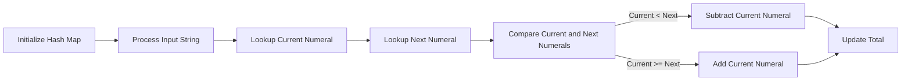

<h2><a href="https://leetcode.com/problems/roman-to-integer">13. Roman to Integer</a></h2>

<p>Roman numerals are represented by seven different symbols:&nbsp;<code>I</code>, <code>V</code>, <code>X</code>, <code>L</code>, <code>C</code>, <code>D</code> and <code>M</code>.</p>

<pre><strong>Symbol</strong>       <strong>Value</strong>
I             1
V             5
X             10
L             50
C             100
D             500
M             1000</pre>

<p>For example,&nbsp;<code>2</code> is written as <code>II</code>&nbsp;in Roman numeral, just two ones added together. <code>12</code> is written as&nbsp;<code>XII</code>, which is simply <code>X + II</code>. The number <code>27</code> is written as <code>XXVII</code>, which is <code>XX + V + II</code>.</p>

<p>Roman numerals are usually written largest to smallest from left to right. However, the numeral for four is not <code>IIII</code>. Instead, the number four is written as <code>IV</code>. Because the one is before the five we subtract it making four. The same principle applies to the number nine, which is written as <code>IX</code>. There are six instances where subtraction is used:</p>

<ul>
	<li><code>I</code> can be placed before <code>V</code> (5) and <code>X</code> (10) to make 4 and 9.&nbsp;</li>
	<li><code>X</code> can be placed before <code>L</code> (50) and <code>C</code> (100) to make 40 and 90.&nbsp;</li>
	<li><code>C</code> can be placed before <code>D</code> (500) and <code>M</code> (1000) to make 400 and 900.</li>
</ul>

<p>Given a roman numeral, convert it to an integer.</p>

<p>&nbsp;</p>
<p><strong class="example">Example 1:</strong></p>

<pre><strong>Input:</strong> s = "III"
<strong>Output:</strong> 3
<strong>Explanation:</strong> III = 3.
</pre>

<p><strong class="example">Example 2:</strong></p>

<pre><strong>Input:</strong> s = "LVIII"
<strong>Output:</strong> 58
<strong>Explanation:</strong> L = 50, V= 5, III = 3.
</pre>

<p><strong class="example">Example 3:</strong></p>

<pre><strong>Input:</strong> s = "MCMXCIV"
<strong>Output:</strong> 1994
<strong>Explanation:</strong> M = 1000, CM = 900, XC = 90 and IV = 4.
</pre>

<p>&nbsp;</p>
<p><strong>Constraints:</strong></p>

<ul>
	<li><code>1 &lt;= s.length &lt;= 15</code></li>
	<li><code>s</code> contains only&nbsp;the characters <code>('I', 'V', 'X', 'L', 'C', 'D', 'M')</code>.</li>
	<li>It is <strong>guaranteed</strong>&nbsp;that <code>s</code> is a valid roman numeral in the range <code>[1, 3999]</code>.</li>
</ul>


---

# 🛍️ Roman-to-Integer | Explained

## Approach 1: Iterative Mapping
### Intuition
The core idea behind this approach is to map each Roman numeral character to its corresponding integer value and then iteratively process the input string. This approach works by utilizing a hash map to store the mapping of Roman numerals to integers, allowing for efficient lookups. By iterating through the input string, we can calculate the total integer value by considering the current numeral and the next one to handle cases where a smaller numeral appears before a larger one (indicating subtraction).
### Algorithm Visualized

### Approach
The algorithm starts by initializing a hash map to store the mapping of Roman numerals to integers. Then, it processes the input string character by character, looking up the current numeral's value in the hash map. If the current numeral is not the last one in the string, it also looks up the next numeral's value. By comparing the current and next numerals, it determines whether to add or subtract the current numeral's value from the total. This process continues until all characters in the input string have been processed.
### Detailed Code Analysis
The code initializes a `HashMap` called `map` to store the mapping of Roman numerals to integers. It then processes the input string `s` character by character using a for loop. Inside the loop, it looks up the current numeral's value in the `map` using `s.charAt(i)` and stores it in the `curr` variable. If the current numeral is not the last one in the string (`i < s.length() - 1`), it also looks up the next numeral's value using `s.charAt(i + 1)` and stores it in the `next` variable. The code then compares the current and next numerals, and if the current numeral is less than the next one, it subtracts the current numeral's value from the `sum`; otherwise, it adds the current numeral's value to the `sum`. If the current numeral is the last one in the string, it simply adds the current numeral's value to the `sum`.
### Code
```java
HashMap<Character, Integer> map = new HashMap<>();
map.put('I', 1);
map.put('V', 5);
map.put('X', 10);
map.put('L', 50);
map.put('C', 100);
map.put('D', 500);
map.put('M', 1000);

int sum = 0;
for (int i = 0; i < s.length(); i++) {
    int curr = map.get(s.charAt(i));
    if (i < s.length() - 1) {
        int next = map.get(s.charAt(i + 1));
        if (curr < next)
            sum -= curr;
        else
            sum += curr;
    } else {
        sum += curr;
    }
}
```
### Complexity
- **Time:** The time complexity of this approach is O(n), where n is the length of the input string. This is because the algorithm processes each character in the input string exactly once.
- **Space:** The space complexity of this approach is O(1), as the hash map stores a constant number of Roman numerals (7 in this case) regardless of the input size. The space required for the input string and the `sum` variable is not included in this analysis, as it is part of the input and output, respectively.

## 🕵️‍♂️ Follow-up Questions (Optional)
Some common follow-up questions for this pattern include:
- How would you handle invalid input, such as a string containing non-Roman numerals?
- Can you optimize the solution to reduce the number of lookups in the hash map?
Brief answers to these questions would involve adding input validation to handle invalid characters and exploring alternative data structures, such as arrays, to reduce lookup time.