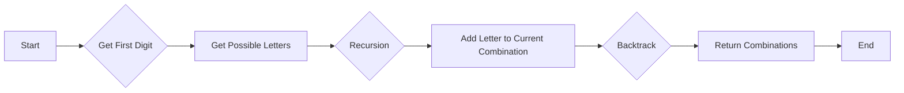

<h2><a href="https://leetcode.com/problems/letter-combinations-of-a-phone-number">17. Letter Combinations of a Phone Number</a></h2>

<p>Given a string containing digits from <code>2-9</code> inclusive, return all possible letter combinations that the number could represent. Return the answer in <strong>any order</strong>.</p>

<p>A mapping of digits to letters (just like on the telephone buttons) is given below. Note that 1 does not map to any letters.</p>

<p>&nbsp;</p>
<p><strong class="example">Example 1:</strong></p>

<pre><strong>Input:</strong> digits = "23"
<strong>Output:</strong> ["ad","ae","af","bd","be","bf","cd","ce","cf"]
</pre>

<p><strong class="example">Example 2:</strong></p>

<pre><strong>Input:</strong> digits = "2"
<strong>Output:</strong> ["a","b","c"]
</pre>

<p>&nbsp;</p>
<p><strong>Constraints:</strong></p>

<ul>
	<li><code>1 &lt;= digits.length &lt;= 4</code></li>
	<li><code>digits[i]</code> is a digit in the range <code>['2', '9']</code>.</li>
</ul>


---

# 🛍️ Letter-Combinations-of-a-Phone-Number | Explained

## Approach 1: Recursive Backtracking
### Intuition
The core idea behind this approach is to utilize recursive backtracking to generate all possible letter combinations of a given phone number. This approach works by exploring each possible letter for each digit in the phone number and recursively generating all combinations. The intuition can be thought of as a tree traversal, where each node represents a digit in the phone number, and each branch represents a possible letter for that digit.

### Algorithm Visualized


### Approach
The approach involves the following steps:
1. Define a recursive function `possibleWords` that takes a string of digits, the current combination of letters, and a list to store the generated combinations.
2. In the `possibleWords` function, check if the input string is empty. If it is, add the current combination to the list of combinations.
3. If the input string is not empty, get the possible letters for the first digit of the string.
4. For each possible letter, recursively call the `possibleWords` function with the remaining digits, the current combination plus the current letter, and the list of combinations.
5. Once all combinations have been generated, return the list of combinations.

### Detailed Code Analysis
Let's dive into the code:
- The `keypad` array is used to map each digit to its possible letters. For example, `keypad[2 - 48]` gives "abc" because the digit 2 corresponds to the letters "a", "b", and "c".
- The `possibleWords` function is a recursive function that generates all possible combinations of letters for a given string of digits.
- In the `possibleWords` function, the base case is when the input string is empty (`s.length() == 0`). In this case, the current combination is added to the list of combinations (`list.add(ans)`).
- The recursive case involves getting the possible letters for the first digit of the string (`String key = keypad[s.charAt(0) - 48]`) and then recursively calling the `possibleWords` function for each possible letter.
- The `letterCombinations` function is the main function that initiates the recursion. It checks if the input string is empty and returns an empty list if it is. Otherwise, it calls the `possibleWords` function with the input string, an empty combination, and a list to store the combinations.
- The `letterCombinations` function returns the list of generated combinations.

### Code
```java
class Solution {
    static String[] keypad={,"abc","def","ghi","jkl","mno","pqrs","tuv","wxyz"};

    public void possibleWords(String s,String ans,List<String> list){
        if(s.length()==0){
            list.add(ans);
            return;
        }
        String key=keypad[s.charAt(0)-48];
        for(int i=0;i<key.length();i++){
            possibleWords(s.substring(1),ans+key.charAt(i),list);
        }
    }
    
    public List<String> letterCombinations(String digits) {
        List<String> list = new ArrayList<>();
        if (digits == null || digits.isEmpty()) {
            return list;
        }
        possibleWords(digits, "", list);
        return list;   
    }
}
```

### Complexity
- **Time:** The time complexity is O(4^n), where n is the length of the input string. This is because each digit can have at most 4 possible letters, and we are generating all possible combinations.
- **Space:** The space complexity is O(n), where n is the length of the input string. This is because we are using recursion, and the maximum depth of the recursion tree is n. Additionally, we are storing the generated combinations in a list, which can contain up to 4^n combinations in the worst case. However, the space complexity is dominated by the recursion stack, which is O(n).

## 🕵️‍♂️ Follow-up Questions (Optional)
Some possible follow-up questions for this problem are:
- How would you optimize the solution to handle very large input strings?
- Can you modify the solution to generate combinations for a specific phone keypad layout (e.g., a phone keypad with a different mapping of digits to letters)? 

Brief answers:
- To handle very large input strings, you could consider using an iterative approach instead of recursion to avoid stack overflow errors. You could also consider using a more efficient data structure, such as a trie, to store the generated combinations.
- To modify the solution for a specific phone keypad layout, you would need to modify the `keypad` array to reflect the correct mapping of digits to letters for that layout. The rest of the solution would remain the same.