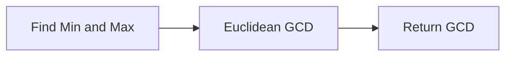

<h2><a href="https://leetcode.com/problems/find-greatest-common-divisor-of-array">1979. Find Greatest Common Divisor of Array</a></h2>

<p>Given an integer array <code>nums</code>, return<strong> </strong><em>the <strong>greatest common divisor</strong> of the smallest number and largest number in </em><code>nums</code>.</p>

<p>The <strong>greatest common divisor</strong> of two numbers is the largest positive integer that evenly divides both numbers.</p>

<p>&nbsp;</p>
<p><strong class="example">Example 1:</strong></p>

<pre><strong>Input:</strong> nums = [2,5,6,9,10]
<strong>Output:</strong> 2
<strong>Explanation:</strong>
The smallest number in nums is 2.
The largest number in nums is 10.
The greatest common divisor of 2 and 10 is 2.
</pre>

<p><strong class="example">Example 2:</strong></p>

<pre><strong>Input:</strong> nums = [7,5,6,8,3]
<strong>Output:</strong> 1
<strong>Explanation:</strong>
The smallest number in nums is 3.
The largest number in nums is 8.
The greatest common divisor of 3 and 8 is 1.
</pre>

<p><strong class="example">Example 3:</strong></p>

<pre><strong>Input:</strong> nums = [3,3]
<strong>Output:</strong> 3
<strong>Explanation:</strong>
The smallest number in nums is 3.
The largest number in nums is 3.
The greatest common divisor of 3 and 3 is 3.
</pre>

<p>&nbsp;</p>
<p><strong>Constraints:</strong></p>

<ul>
	<li><code>2 &lt;= nums.length &lt;= 1000</code></li>
	<li><code>1 &lt;= nums[i] &lt;= 1000</code></li>
</ul>


---

# 🛍️ Find-Greatest-Common-Divisor-of-Array | Explained

## Approach 1: Euclidean GCD Algorithm with Min-Max Optimization
### Intuition
The approach works by first finding the minimum and maximum numbers in the given array, and then using the Euclidean algorithm to find the greatest common divisor (GCD) of these two numbers. The intuition behind this is that the GCD of an array of numbers is the same as the GCD of the minimum and maximum numbers in the array. This is because any common divisor of the array must divide both the smallest and largest numbers.

### Algorithm Visualized

### Approach
The approach can be broken down into two main steps:
1. Find the minimum and maximum numbers in the array.
2. Use the Euclidean algorithm to find the GCD of the minimum and maximum numbers.
The Euclidean algorithm works by repeatedly replacing the larger number with the remainder of dividing the larger number by the smaller number, until the remainder is zero. At this point, the non-zero remainder is the GCD.

### Detailed Code Analysis
The code starts by defining a private helper method `gcd` that takes two integers `a` and `b` as input and returns their GCD using the Euclidean algorithm.
- Line 4: `private int gcd(int a, int b) {` defines the start of the `gcd` method.
- Line 5: `while (b != 0) {` starts a loop that continues until `b` is zero.
- Lines 6-8: `int temp = b; b = a % b; a = temp;` simultaneously update the values of `a` and `b` for the next iteration of the loop. This is the core of the Euclidean algorithm.
- Line 11: `return a;` returns the GCD of the original two numbers.
The main method `findGCD` finds the minimum and maximum numbers in the array and then calls the `gcd` method to find their GCD.
- Lines 16-17: `int min = nums[0]; int max = nums[0];` initialize `min` and `max` to the first element of the array.
- Lines 19-27: The loop iterates over each element `x` in the array, updating `min` and `max` as necessary.
- Line 29: `return gcd(min, max);` calls the `gcd` method to find the GCD of `min` and `max`.

### Code
```java
private int gcd(int a, int b) {
    while (b != 0) {
        int temp = b;
        b = a % b;
        a = temp;
    }
    return a;
}

public int findGCD(int[] nums) {
    int min = nums[0];
    int max = nums[0];

    for (int x : nums) {
        if (x < min) {
            min = x;
        }

        if (x > max) {
            max = x;
        }
    }

    return gcd(min, max);
}
```
### Complexity
- **Time:** The time complexity of this approach is O(n + log(max)), where n is the length of the input array and max is the maximum number in the array. The O(n) term comes from finding the minimum and maximum numbers in the array, and the O(log(max)) term comes from the Euclidean algorithm.
- **Space:** The space complexity of this approach is O(1), which means the space required does not change with the size of the input array, making it very efficient in terms of memory usage.