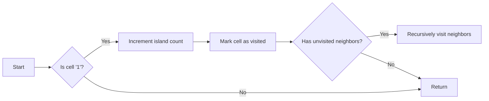

<h2><a href="https://leetcode.com/problems/number-of-islands">200. Number of Islands</a></h2>

<p>Given an <code>m x n</code> 2D binary grid <code>grid</code> which represents a map of <code>'1'</code>s (land) and <code>'0'</code>s (water), return <em>the number of islands</em>.</p>

<p>An <strong>island</strong> is surrounded by water and is formed by connecting adjacent lands horizontally or vertically. You may assume all four edges of the grid are all surrounded by water.</p>

<p>&nbsp;</p>
<p><strong class="example">Example 1:</strong></p>

<pre><strong>Input:</strong> grid = [
  ["1","1","1","1","0"],
  ["1","1","0","1","0"],
  ["1","1","0","0","0"],
  ["0","0","0","0","0"]
]
<strong>Output:</strong> 1
</pre>

<p><strong class="example">Example 2:</strong></p>

<pre><strong>Input:</strong> grid = [
  ["1","1","0","0","0"],
  ["1","1","0","0","0"],
  ["0","0","1","0","0"],
  ["0","0","0","1","1"]
]
<strong>Output:</strong> 3
</pre>

<p>&nbsp;</p>
<p><strong>Constraints:</strong></p>

<ul>
	<li><code>m == grid.length</code></li>
	<li><code>n == grid[i].length</code></li>
	<li><code>1 &lt;= m, n &lt;= 300</code></li>
	<li><code>grid[i][j]</code> is <code>'0'</code> or <code>'1'</code>.</li>
</ul>


---

# 🛍️ Number-of-Islands | Explained

## Approach 1: Depth-First Search (DFS)
### Intuition
The intuition behind this approach is to traverse the grid and identify islands by using a Depth-First Search (DFS) algorithm. When a land cell ('1') is encountered, it increments the island count and then uses DFS to mark all connected land cells as visited ('0'). This approach works because it effectively groups all connected land cells into a single island, allowing for an accurate count of the total number of islands.

### Algorithm Visualized


### Approach
The algorithm starts by iterating through each cell in the grid. When a land cell ('1') is encountered, it increments the island count and then uses DFS to mark all connected land cells as visited ('0'). The DFS function checks all four directions (up, down, left, right) for unvisited land cells and recursively visits them.

### Detailed Code Analysis
The code starts by initializing a variable `ans` to store the total number of islands. It then iterates through each cell in the grid using two nested loops. When a land cell ('1') is encountered, it increments the `ans` variable and calls the `dfs` function to mark all connected land cells as visited.

The `dfs` function checks if the current cell is within the grid boundaries and if it is a land cell ('1'). If not, it returns immediately. Otherwise, it marks the current cell as visited by setting its value to '0' and then recursively calls itself for all four directions (up, down, left, right).

### Code
```java
class Solution {
    public int numIslands(char[][] grid) {
        int ans = 0;
        for (int i = 0; i < grid.length; i++) {
            for (int j = 0; j < grid[0].length; j++) {
                if (grid[i][j] == '1') {
                    ans += 1;
                    dfs(grid, i, j);
                }
            }
        }
        return ans;
    }

    public void dfs(char[][] grid, int i, int j) {
        if (i < 0 || i >= grid.length || j < 0 || j >= grid[0].length || grid[i][j] == '0') {
            return;
        }
        grid[i][j] = '0';
        dfs(grid, i + 1, j);
        dfs(grid, i, j + 1);
        dfs(grid, i, j - 1);
        dfs(grid, i - 1, j);
    }
}
```

### Complexity
- **Time:** O(M * N), where M is the number of rows and N is the number of columns in the grid. This is because in the worst case, we need to visit every cell in the grid.
- **Space:** O(M * N), which is the maximum depth of the recursive call stack in the worst case (when the grid is filled with lands).

## 🕵️‍♂️ Follow-up Questions (Optional)
Some common follow-up questions for this pattern include:
1. What if the grid is extremely large and doesn't fit into memory? How would you optimize the solution for this case?
   - The solution can be optimized by using an iterative approach instead of a recursive one, which would reduce the memory usage. Additionally, we can use a queue to store the cells to be visited instead of using the call stack.
2. How would you modify the solution to count the number of islands in a 3D grid?
   - To count the number of islands in a 3D grid, we would need to modify the DFS function to visit all six directions (up, down, left, right, front, back) instead of just four. We would also need to modify the grid representation to accommodate the third dimension.