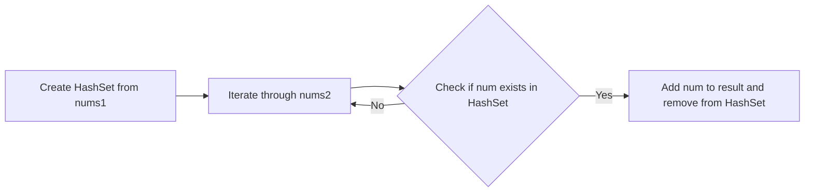

<h2><a href="https://leetcode.com/problems/intersection-of-two-arrays">349. Intersection of Two Arrays</a></h2>

<p>Given two integer arrays <code>nums1</code> and <code>nums2</code>, return <em>an array of their <span data-keyword="array-intersection" class=" cursor-pointer relative text-dark-blue-s text-sm"><button type="button" aria-haspopup="dialog" aria-expanded="false" aria-controls="radix-_r_1o_" data-state="closed" class="">intersection</button></span></em>. Each element in the result must be <strong>unique</strong> and you may return the result in <strong>any order</strong>.</p>

<p>&nbsp;</p>
<p><strong class="example">Example 1:</strong></p>

<pre><strong>Input:</strong> nums1 = [1,2,2,1], nums2 = [2,2]
<strong>Output:</strong> [2]
</pre>

<p><strong class="example">Example 2:</strong></p>

<pre><strong>Input:</strong> nums1 = [4,9,5], nums2 = [9,4,9,8,4]
<strong>Output:</strong> [9,4]
<strong>Explanation:</strong> [4,9] is also accepted.
</pre>

<p>&nbsp;</p>
<p><strong>Constraints:</strong></p>

<ul>
	<li><code>1 &lt;= nums1.length, nums2.length &lt;= 1000</code></li>
	<li><code>0 &lt;= nums1[i], nums2[i] &lt;= 1000</code></li>
</ul>


---

# 🛍️ Intersection-of-Two-Arrays | Explained

## Approach 1: HashSet-Based Approach
### Intuition
The intuition behind this approach can be understood by visualizing two arrays as two sets of items. To find the intersection, we need to identify the common items between the two sets. A real-world analogy for this would be finding the common books between two bookshelves. We can create an index or a catalog for the first bookshelf and then check each book from the second bookshelf against this catalog to find the common books. This approach works because it allows us to efficiently keep track of the items we have seen so far and check for duplicates in constant time.

### Algorithm Visualized


### Approach
The approach involves creating a HashSet from the first array, then iterating through the second array. For each element in the second array, we check if it exists in the HashSet. If it does, we add it to the result and remove it from the HashSet to avoid duplicates. This process continues until we have iterated through the entire second array.

### Detailed Code Analysis
Let's break down the code step by step:
- `HashSet<Integer> set=new HashSet<Integer>();` and `ArrayList<Integer> ans = new ArrayList<>();` are used to store the elements from the first array and the result, respectively. The HashSet allows for constant time complexity when checking for the existence of an element and removing it, which is crucial for avoiding duplicates in the result.
- The first for-each loop `for(int x:nums1){ set.add(x); }` populates the HashSet with elements from the first array.
- The second for-each loop `for (int num : nums2)` iterates through the second array.
  - Inside this loop, `if (set.contains(num))` checks if the current element exists in the HashSet. If it does, `ans.add(num);` adds the element to the result, and `set.remove(num);` removes it from the HashSet to prevent adding the same element multiple times to the result.
- After iterating through the second array, `int result[] = new int[ans.size();` creates an integer array to store the final result.
- The final for loop `for (int i = 0; i < ans.size(); i++) { result[i] = ans.get(i); }` populates the result array with elements from the ArrayList.

### Code
```java
HashSet<Integer> set = new HashSet<Integer>();
ArrayList<Integer> ans = new ArrayList<>();
for (int x : nums1) {
    set.add(x);
}
for (int num : nums2) {
    if (set.contains(num)) {
        ans.add(num);
        set.remove(num); // avoid duplicates
    }
}
int result[] = new int[ans.size()];
for (int i = 0; i < ans.size(); i++) {
    result[i] = ans.get(i);
}
return result;
```

### Complexity
- **Time:** The time complexity is O(n + m), where n and m are the sizes of the input arrays `nums1` and `nums2`, respectively. This is because we perform a constant amount of work for each element in both arrays.
- **Space:** The space complexity is also O(n + m), where n is the size of `nums1` (for the HashSet) and m is the size of `nums2` in the worst case (when all elements of `nums2` are in `nums1`, for the ArrayList). However, in practice, the space used is less than this because we only store unique elements from `nums1` and common elements between `nums1` and `nums2`.