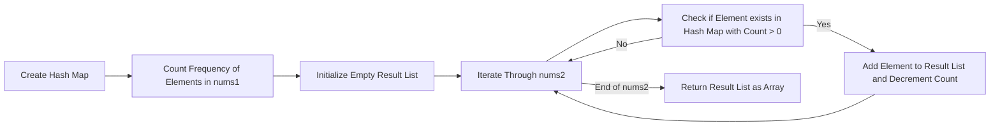

<h2><a href="https://leetcode.com/problems/intersection-of-two-arrays-ii">350. Intersection of Two Arrays II</a></h2>

<p>Given two integer arrays <code>nums1</code> and <code>nums2</code>, return <em>an array of their intersection</em>. Each element in the result must appear as many times as it shows in both arrays and you may return the result in <strong>any order</strong>.</p>

<p>&nbsp;</p>
<p><strong class="example">Example 1:</strong></p>

<pre><strong>Input:</strong> nums1 = [1,2,2,1], nums2 = [2,2]
<strong>Output:</strong> [2,2]
</pre>

<p><strong class="example">Example 2:</strong></p>

<pre><strong>Input:</strong> nums1 = [4,9,5], nums2 = [9,4,9,8,4]
<strong>Output:</strong> [4,9]
<strong>Explanation:</strong> [9,4] is also accepted.
</pre>

<p>&nbsp;</p>
<p><strong>Constraints:</strong></p>

<ul>
	<li><code>1 &lt;= nums1.length, nums2.length &lt;= 1000</code></li>
	<li><code>0 &lt;= nums1[i], nums2[i] &lt;= 1000</code></li>
</ul>

<p>&nbsp;</p>
<p><strong>Follow up:</strong></p>

<ul>
	<li>What if the given array is already sorted? How would you optimize your algorithm?</li>
	<li>What if <code>nums1</code>'s size is small compared to <code>nums2</code>'s size? Which algorithm is better?</li>
	<li>What if elements of <code>nums2</code> are stored on disk, and the memory is limited such that you cannot load all elements into the memory at once?</li>
</ul>


---

# 🛍️ Intersection-of-Two-Arrays-II | Explained

## Approach 1: Hash Map Frequency Counter
### Intuition
The core idea behind this approach is to utilize a hash map to count the frequency of each element in the first array, and then iterate through the second array, checking if each element exists in the hash map with a count greater than 0. This approach works because it allows us to efficiently keep track of the frequency of elements in the first array, and then use this information to find the intersection with the second array. The hash map enables us to perform constant-time lookups, making the overall algorithm efficient.

### Algorithm Visualized


### Approach
The algorithm consists of the following high-level steps:
1. Create a hash map to store the frequency of elements in the first array.
2. Iterate through the first array and update the frequency of each element in the hash map.
3. Initialize an empty list to store the intersection result.
4. Iterate through the second array, checking if each element exists in the hash map with a frequency greater than 0.
5. If an element exists in the hash map with a frequency greater than 0, add it to the result list and decrement its frequency in the hash map.
6. Finally, convert the result list to an array and return it.

### Detailed Code Analysis
The provided code implements the above approach using Java. Here's a detailed breakdown of the code:
- Lines 3-7: A `HashMap` named `map` is created to store the frequency of elements in `nums1`. The `for` loop iterates through `nums1`, and for each element, it uses `map.getOrDefault(x, 0) + 1` to update its frequency in the hash map.
- Lines 9-19: An `ArrayList` named `ans` is created to store the intersection result. The `for` loop iterates through `nums2`, and for each element, it checks if the element exists in the hash map with a frequency greater than 0 using `map.containsKey(x) && map.get(x) > 0`. If the condition is true, it adds the element to the result list and decrements its frequency in the hash map.
- Lines 21-25: The result list `ans` is converted to an array `res` and returned.

### Code
```java
class Solution {
    public int[] intersect(int[] nums1, int[] nums2) {
        HashMap<Integer,Integer> map = new HashMap<>();
        
        for(int x : nums1){
            map.put(x, map.getOrDefault(x,0)+1);
        }
        
        ArrayList<Integer> ans = new ArrayList<>();
        
        for(int x : nums2){
            if(map.containsKey(x) && map.get(x) > 0){
                ans.add(x);
                map.put(x, map.get(x)-1);
            }
        }
        
        int res[] = new int[ans.size()];
        
        for(int i=0;i<ans.size();i++)
            res[i]=ans.get(i);
        
        return res;
    }
}
```

### Complexity
- **Time:** O(n + m), where n and m are the lengths of `nums1` and `nums2`, respectively. This is because the algorithm iterates through both arrays once.
- **Space:** O(n + m), where n and m are the lengths of `nums1` and `nums2`, respectively. This is because the algorithm uses a hash map to store the frequency of elements in `nums1`, and an array list to store the intersection result. The maximum size of the hash map and the array list is proportional to the lengths of the input arrays.

## 🕵️‍♂️ Follow-up Questions (Optional)
Some possible follow-up questions for this problem could be:
- What if the input arrays are extremely large and do not fit in memory? 
  - In this case, a possible solution would be to use a disk-based hash map or a distributed computing approach to handle the large input data.
- How can we optimize the algorithm if the input arrays are sorted?
  - If the input arrays are sorted, we can use a two-pointer technique to find the intersection in O(n + m) time, which is more efficient than the hash map approach for large input arrays.