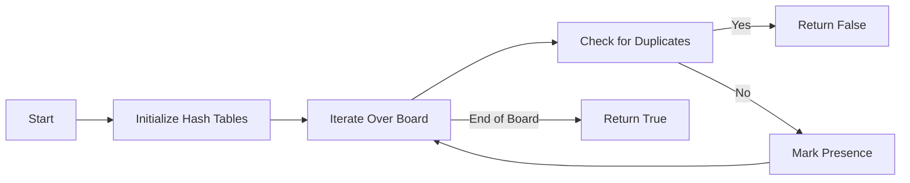

<h2><a href="https://leetcode.com/problems/valid-sudoku">36. Valid Sudoku</a></h2>

<p>Determine if a&nbsp;<code>9 x 9</code> Sudoku board&nbsp;is valid.&nbsp;Only the filled cells need to be validated&nbsp;<strong>according to the following rules</strong>:</p>

<ol>
	<li>Each row&nbsp;must contain the&nbsp;digits&nbsp;<code>1-9</code> without repetition.</li>
	<li>Each column must contain the digits&nbsp;<code>1-9</code>&nbsp;without repetition.</li>
	<li>Each of the nine&nbsp;<code>3 x 3</code> sub-boxes of the grid must contain the digits&nbsp;<code>1-9</code>&nbsp;without repetition.</li>
</ol>

<p><strong>Note:</strong></p>

<ul>
	<li>A Sudoku board (partially filled) could be valid but is not necessarily solvable.</li>
	<li>Only the filled cells need to be validated according to the mentioned&nbsp;rules.</li>
</ul>

<p>&nbsp;</p>
<p><strong class="example">Example 1:</strong></p>

<pre><strong>Input:</strong> board = 
[["5","3",".",".","7",".",".",".","."]
,["6",".",".","1","9","5",".",".","."]
,[".","9","8",".",".",".",".","6","."]
,["8",".",".",".","6",".",".",".","3"]
,["4",".",".","8",".","3",".",".","1"]
,["7",".",".",".","2",".",".",".","6"]
,[".","6",".",".",".",".","2","8","."]
,[".",".",".","4","1","9",".",".","5"]
,[".",".",".",".","8",".",".","7","9"]]
<strong>Output:</strong> true
</pre>

<p><strong class="example">Example 2:</strong></p>

<pre><strong>Input:</strong> board = 
[["8","3",".",".","7",".",".",".","."]
,["6",".",".","1","9","5",".",".","."]
,[".","9","8",".",".",".",".","6","."]
,["8",".",".",".","6",".",".",".","3"]
,["4",".",".","8",".","3",".",".","1"]
,["7",".",".",".","2",".",".",".","6"]
,[".","6",".",".",".",".","2","8","."]
,[".",".",".","4","1","9",".",".","5"]
,[".",".",".",".","8",".",".","7","9"]]
<strong>Output:</strong> false
<strong>Explanation:</strong> Same as Example 1, except with the <strong>5</strong> in the top left corner being modified to <strong>8</strong>. Since there are two 8's in the top left 3x3 sub-box, it is invalid.
</pre>

<p>&nbsp;</p>
<p><strong>Constraints:</strong></p>

<ul>
	<li><code>board.length == 9</code></li>
	<li><code>board[i].length == 9</code></li>
	<li><code>board[i][j]</code> is a digit <code>1-9</code> or <code>'.'</code>.</li>
</ul>


---

# 🛍️ Valid-Sudoku | Explained

## Approach 1: Hashing-Based Approach
### Intuition
The core idea behind this approach is to utilize hashing to keep track of the numbers that have been encountered in each row, column, and 3x3 sub-box. This approach works by iterating over the Sudoku board and marking the presence of each number in its corresponding row, column, and sub-box. If a duplicate number is found, the function immediately returns false, indicating that the Sudoku board is not valid.

### Algorithm Visualized


### Approach
The algorithm starts by initializing three 2D boolean arrays to represent the rows, columns, and sub-boxes. It then iterates over each cell in the Sudoku board. If the cell is empty (i.e., '.'), it skips to the next cell. Otherwise, it calculates the index of the sub-box and checks if the number has been encountered before in the current row, column, or sub-box. If a duplicate is found, it returns false. If not, it marks the presence of the number in the corresponding hash tables.

### Detailed Code Analysis
The code starts by initializing three 2D boolean arrays `rowHasNumber`, `colHasNumber`, and `subBoxHasNumber` to keep track of the numbers that have been encountered in each row, column, and sub-box, respectively.
```java
boolean[][] rowHasNumber = new boolean[9][9];
boolean[][] colHasNumber = new boolean[9][9];
boolean[][] subBoxHasNumber = new boolean[9][9];
```
The code then iterates over each cell in the Sudoku board using two nested for loops.
```java
for (int row = 0; row < 9; row++) {
    for (int col = 0; col < 9; col++) {
        // ...
    }
}
```
Inside the loop, it checks if the current cell is empty. If it is, it skips to the next cell.
```java
char currentCell = board[row][col];
if (currentCell == '.') {
    continue;
}
```
If the cell is not empty, it calculates the index of the sub-box and the digit index.
```java
int digitIndex = currentCell - '0' - 1;
int subBoxIndex = (row / 3) * 3 + (col / 3);
```
It then checks if the number has been encountered before in the current row, column, or sub-box. If a duplicate is found, it returns false.
```java
if (rowHasNumber[row][digitIndex] ||
    colHasNumber[col][digitIndex] || 
    subBoxHasNumber[subBoxIndex][digitIndex]) {
    return false;
}
```
If not, it marks the presence of the number in the corresponding hash tables.
```java
rowHasNumber[row][digitIndex] = true;
colHasNumber[col][digitIndex] = true;
subBoxHasNumber[subBoxIndex][digitIndex] = true;
```
### Code
```java
class Solution {
    public boolean isValidSudoku(char[][] board) {
        boolean[][] rowHasNumber = new boolean[9][9];
        boolean[][] colHasNumber = new boolean[9][9];
        boolean[][] subBoxHasNumber = new boolean[9][9];

        for (int row = 0; row < 9; row++) {
            for (int col = 0; col < 9; col++) {
                char currentCell = board[row][col];
                if (currentCell == '.') {
                    continue;
                }
                int digitIndex = currentCell - '0' - 1;
                int subBoxIndex = (row / 3) * 3 + (col / 3);
                if (rowHasNumber[row][digitIndex] ||
                    colHasNumber[col][digitIndex] || 
                    subBoxHasNumber[subBoxIndex][digitIndex]) {
                    return false;
                }
                rowHasNumber[row][digitIndex] = true;
                colHasNumber[col][digitIndex] = true;
                subBoxHasNumber[subBoxIndex][digitIndex] = true;
            }
        }
        return true;
    }
}
```

### Complexity
- **Time:** O(1), since the size of the Sudoku board is fixed (9x9). The algorithm iterates over each cell in the board once, resulting in a constant time complexity.
- **Space:** O(1), since the space used does not grow with the size of the input. The algorithm uses three 2D boolean arrays of fixed size (9x9) to keep track of the numbers that have been encountered in each row, column, and sub-box.

## 🕵️‍♂️ Follow-up Questions (Optional)
Some common follow-up questions for this pattern include:
* How would you optimize this solution for a larger Sudoku board?
* Can you implement this solution using a different data structure, such as a hash set?