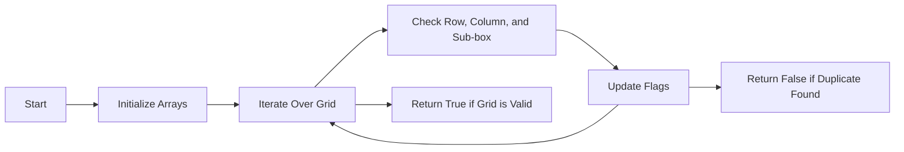

<h2><a href="https://leetcode.com/problems/valid-sudoku">36. Valid Sudoku</a></h2>

<p>Determine if a&nbsp;<code>9 x 9</code> Sudoku board&nbsp;is valid.&nbsp;Only the filled cells need to be validated&nbsp;<strong>according to the following rules</strong>:</p>

<ol>
	<li>Each row&nbsp;must contain the&nbsp;digits&nbsp;<code>1-9</code> without repetition.</li>
	<li>Each column must contain the digits&nbsp;<code>1-9</code>&nbsp;without repetition.</li>
	<li>Each of the nine&nbsp;<code>3 x 3</code> sub-boxes of the grid must contain the digits&nbsp;<code>1-9</code>&nbsp;without repetition.</li>
</ol>

<p><strong>Note:</strong></p>

<ul>
	<li>A Sudoku board (partially filled) could be valid but is not necessarily solvable.</li>
	<li>Only the filled cells need to be validated according to the mentioned&nbsp;rules.</li>
</ul>

<p>&nbsp;</p>
<p><strong class="example">Example 1:</strong></p>

<pre><strong>Input:</strong> board = 
[["5","3",".",".","7",".",".",".","."]
,["6",".",".","1","9","5",".",".","."]
,[".","9","8",".",".",".",".","6","."]
,["8",".",".",".","6",".",".",".","3"]
,["4",".",".","8",".","3",".",".","1"]
,["7",".",".",".","2",".",".",".","6"]
,[".","6",".",".",".",".","2","8","."]
,[".",".",".","4","1","9",".",".","5"]
,[".",".",".",".","8",".",".","7","9"]]
<strong>Output:</strong> true
</pre>

<p><strong class="example">Example 2:</strong></p>

<pre><strong>Input:</strong> board = 
[["8","3",".",".","7",".",".",".","."]
,["6",".",".","1","9","5",".",".","."]
,[".","9","8",".",".",".",".","6","."]
,["8",".",".",".","6",".",".",".","3"]
,["4",".",".","8",".","3",".",".","1"]
,["7",".",".",".","2",".",".",".","6"]
,[".","6",".",".",".",".","2","8","."]
,[".",".",".","4","1","9",".",".","5"]
,[".",".",".",".","8",".",".","7","9"]]
<strong>Output:</strong> false
<strong>Explanation:</strong> Same as Example 1, except with the <strong>5</strong> in the top left corner being modified to <strong>8</strong>. Since there are two 8's in the top left 3x3 sub-box, it is invalid.
</pre>

<p>&nbsp;</p>
<p><strong>Constraints:</strong></p>

<ul>
	<li><code>board.length == 9</code></li>
	<li><code>board[i].length == 9</code></li>
	<li><code>board[i][j]</code> is a digit <code>1-9</code> or <code>'.'</code>.</li>
</ul>


---

# 🛍️ Valid-Sudoku | Explained

## Approach 1: Iterative Sudoku Validation
### Intuition
The provided code uses an iterative approach to validate a Sudoku puzzle. The core idea is to iterate over each cell in the Sudoku grid, checking if the current number already exists in the same row, column, or 3x3 sub-box. This approach works by ensuring that each number from 1 to 9 appears only once in each row, column, and sub-box, which is the fundamental rule of Sudoku.

### Algorithm Visualized


### Approach
The algorithm starts by initializing three 2D arrays (or matrices) to keep track of the numbers found in each row, column, and sub-box. It then iterates over each cell in the Sudoku grid. For each cell, it checks if the current number already exists in the same row, column, or sub-box by looking up the corresponding flags in the arrays. If a duplicate is found, the function immediately returns False. If no duplicates are found after checking all cells, the function returns True, indicating that the Sudoku puzzle is valid.

### Detailed Code Analysis
The code provided is a part of the iterative validation approach. It seems to be checking if a given digit already exists in the current row, column, or sub-box. The specific lines of code are:
```java
if (rowHasNumber[row][digitIndex] || 
    colHasNumber[col][digitIndex] || 
    subBoxHasNumber[subBoxIndex][digitIndex]){
    return false;
}
rowHasNumber[row][digitIndex]=true;
colHasNumber[col][digitIndex]=true;
subBoxHasNumber[subBoxIndex][digitIndex]=true;
```
Here, `rowHasNumber`, `colHasNumber`, and `subBoxHasNumber` are 2D arrays that keep track of the numbers found in each row, column, and sub-box, respectively. The indices `row`, `col`, and `subBoxIndex` are used to access the correct sub-array for the current cell, and `digitIndex` corresponds to the current number being checked (1-9).

### Code
```java
public boolean isValidSudoku(char[][] board) {
    boolean[][] rowHasNumber = new boolean[9][9];
    boolean[][] colHasNumber = new boolean[9][9];
    boolean[][] subBoxHasNumber = new boolean[9][9];

    for (int i = 0; i < 9; i++) {
        for (int j = 0; j < 9; j++) {
            char digit = board[i][j];
            if (digit == '.') {
                continue;
            }
            int digitIndex = digit - '1';
            int subBoxIndex = (i / 3) * 3 + j / 3;
            if (rowHasNumber[i][digitIndex] || 
                colHasNumber[j][digitIndex] || 
                subBoxHasNumber[subBoxIndex][digitIndex]){
                return false;
            }
            rowHasNumber[i][digitIndex]=true;
            colHasNumber[j][digitIndex]=true;
            subBoxHasNumber[subBoxIndex][digitIndex]=true;
        }
    }
    return true;
}
```

### Complexity
- **Time:** O(1) because the size of the Sudoku grid is fixed (9x9), resulting in a constant number of iterations. However, if we were to consider the size of the grid as a variable (n x n), the time complexity would be O(n^2).
- **Space:** O(1) because the size of the arrays used to track numbers is also fixed, resulting in a constant amount of memory used. Again, considering a variable-sized grid, the space complexity would be O(n^2).