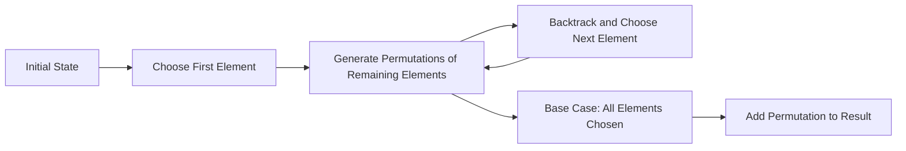

<h2><a href="https://leetcode.com/problems/permutations">46. Permutations</a></h2>

<p>Given an array <code>nums</code> of distinct integers, return all the possible <span data-keyword="permutation-array" class=" cursor-pointer relative text-dark-blue-s text-sm"><button type="button" aria-haspopup="dialog" aria-expanded="false" aria-controls="radix-_r_1o_" data-state="closed" class="">permutations</button></span>. You can return the answer in <strong>any order</strong>.</p>

<p>&nbsp;</p>
<p><strong class="example">Example 1:</strong></p>
<pre><strong>Input:</strong> nums = [1,2,3]
<strong>Output:</strong> [[1,2,3],[1,3,2],[2,1,3],[2,3,1],[3,1,2],[3,2,1]]
</pre><p><strong class="example">Example 2:</strong></p>
<pre><strong>Input:</strong> nums = [0,1]
<strong>Output:</strong> [[0,1],[1,0]]
</pre><p><strong class="example">Example 3:</strong></p>
<pre><strong>Input:</strong> nums = [1]
<strong>Output:</strong> [[1]]
</pre>
<p>&nbsp;</p>
<p><strong>Constraints:</strong></p>

<ul>
	<li><code>1 &lt;= nums.length &lt;= 6</code></li>
	<li><code>-10 &lt;= nums[i] &lt;= 10</code></li>
	<li>All the integers of <code>nums</code> are <strong>unique</strong>.</li>
</ul>


---

# 🛍️ Permutations | Explained

## Approach 1: Backtracking
### Intuition
The core idea behind this approach is to use backtracking to generate all permutations of the input array. This approach works by fixing one element at a time and recursively generating all permutations of the remaining elements. It's similar to how we would manually generate all permutations of a set of elements - by choosing one element, then generating all permutations of the remaining elements, and so on.

### Algorithm Visualized


### Approach
The algorithm works as follows:
1. Start with the initial state, where no elements have been chosen.
2. Choose the first element from the input array and generate all permutations of the remaining elements.
3. Backtrack and choose the next element from the input array, then generate all permutations of the remaining elements.
4. Repeat steps 2 and 3 until all elements have been chosen (base case).
5. Add each generated permutation to the result.

### Detailed Code Analysis
The code provided uses a recursive backtracking approach to generate all permutations of the input array. Here's a line-by-line breakdown:
- `public List<List<Integer>> permute(int[] nums)`: This is the main function that takes an input array `nums` and returns a list of lists, where each inner list is a permutation of `nums`.
- `List<List<Integer>> ans = new ArrayList<>();`: An empty list is initialized to store the result.
- `backtrack(nums, 0, ans);`: The `backtrack` function is called with the input array, an initial index of 0, and the result list.
- In the `backtrack` function:
  - `if (index == nums.length)`: This is the base case, where all elements have been chosen. A new permutation is added to the result list.
  - `for (int i = index; i < nums.length; i++)`: This loop iterates over the remaining elements in the input array, starting from the current index.
  - `int t = nums[index];`: A temporary variable is used to swap elements.
  - `nums[index] = nums[i];` and `nums[i] = t;`: The current element is swapped with the `i-th` element.
  - `backtrack(nums, index + 1, ans);`: The `backtrack` function is recursively called with the updated index and the result list.
  - `t = nums[index];`, `nums[index] = nums[i];`, and `nums[i] = t;`: The elements are swapped back to their original positions (backtracking).

### Code
```java
class Solution {
    public List<List<Integer>> permute(int[] nums) {
        List<List<Integer>> ans = new ArrayList<>();
        backtrack(nums, 0, ans);
        return ans;
    }

    void backtrack(int[] nums, int index, List<List<Integer>> ans) {
        if (index == nums.length) {
            List<Integer> temp = new ArrayList<>();
            for (int num : nums)
                temp.add(num);
            ans.add(temp);
            return;
        }

        for (int i = index; i < nums.length; i++) {
            int t = nums[index];
            nums[index] = nums[i];
            nums[i] = t;

            backtrack(nums, index + 1, ans);

            t = nums[index];
            nums[index] = nums[i];
            nums[i] = t;
        }
    }
}
```

### Complexity
- **Time:** The time complexity of this approach is O(n!), where n is the number of elements in the input array. This is because there are n! permutations of n elements, and the algorithm generates each permutation exactly once.
- **Space:** The space complexity of this approach is O(n), which is the maximum recursion depth. The space required to store the result is also O(n!), as there are n! permutations in the worst case. However, the space complexity in terms of the input size is O(n), which is the space required to store the input array and the temporary variables.

## 🕵️‍♂️ Follow-up Questions (Optional)
Some common follow-up questions for this pattern include:
- How would you optimize the space complexity of this approach?
  - Answer: The space complexity is already optimized, as the algorithm only uses a constant amount of space to store the temporary variables and the recursion stack. However, the space required to store the result can be optimized by using an iterator-based approach or a generator-based approach, where the permutations are generated on-the-fly and not stored in memory all at once.
- How would you modify the algorithm to generate permutations of a specific length?
  - Answer: To generate permutations of a specific length k, you can modify the algorithm to only generate permutations of the first k elements. This can be done by passing the first k elements of the input array to the `backtrack` function and modifying the base case to stop when k elements have been chosen.