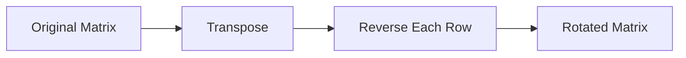

<h2><a href="https://leetcode.com/problems/rotate-image">48. Rotate Image</a></h2>

<p>You are given an <code>n x n</code> 2D <code>matrix</code> representing an image, rotate the image by <strong>90</strong> degrees (clockwise).</p>

<p>You have to rotate the image <a href="https://en.wikipedia.org/wiki/In-place_algorithm" target="_blank"><strong>in-place</strong></a>, which means you have to modify the input 2D matrix directly. <strong>DO NOT</strong> allocate another 2D matrix and do the rotation.</p>

<p>&nbsp;</p>
<p><strong class="example">Example 1:</strong></p>

<pre><strong>Input:</strong> matrix = [[1,2,3],[4,5,6],[7,8,9]]
<strong>Output:</strong> [[7,4,1],[8,5,2],[9,6,3]]
</pre>

<p><strong class="example">Example 2:</strong></p>

<pre><strong>Input:</strong> matrix = [[5,1,9,11],[2,4,8,10],[13,3,6,7],[15,14,12,16]]
<strong>Output:</strong> [[15,13,2,5],[14,3,4,1],[12,6,8,9],[16,7,10,11]]
</pre>

<p>&nbsp;</p>
<p><strong>Constraints:</strong></p>

<ul>
	<li><code>n == matrix.length == matrix[i].length</code></li>
	<li><code>1 &lt;= n &lt;= 20</code></li>
	<li><code>-1000 &lt;= matrix[i][j] &lt;= 1000</code></li>
</ul>


---

# 🛍️ Rotate-Image | Explained

## Approach 1: Transpose and Reverse
### Intuition
This approach works by first transposing the matrix (swapping the row and column indices of each element) and then reversing each row. The intuition is similar to how you would rotate a physical image - you first need to change the orientation of the image (transpose), and then flip it to get the desired rotation (reverse). This approach takes advantage of the fact that a 90-degree rotation of a square matrix can be achieved by transposing the matrix and then reversing each row.

### Algorithm Visualized


### Approach
The algorithm works by first transposing the matrix, which means swapping the row and column indices of each element. After transposing, the matrix is reversed row by row to achieve the desired rotation.

### Detailed Code Analysis
Let's dive into the code:
- The first line `int n = matrix.length;` gets the number of rows in the matrix, which is also the number of columns since the matrix is a square matrix.
- The nested for loops starting from line 6 (`for (int i = 0; i < n; i++)`) traverse the matrix and transpose it. The outer loop iterates over each row, and the inner loop iterates over each column starting from the current row index `i`. This is done to avoid redundant swaps since the matrix is symmetric after transposition.
- Inside the inner loop, the code swaps the elements at position `(i, j)` and `(j, i)` using a temporary variable `temp`. This is the actual transposition step.
- After transposing the matrix, the code reverses each row using a two-pointer technique. The outer loop starting from line 14 (`for (int i = 0; i < n; i++)`) iterates over each row.
- Inside this loop, two pointers `left` and `right` are initialized to the start and end of the current row, respectively.
- The while loop starting from line 17 (`while (left < right)`) moves the pointers towards each other, swapping the elements at the `left` and `right` indices in each iteration.
- Once the pointers meet or cross, the row has been reversed, and the process moves on to the next row.

### Code
```java
public void rotate(int[][] matrix) {
    int n = matrix.length;

    for (int i = 0; i < n; i++) {
        for (int j = i; j < n; j++) {
            int temp = matrix[i][j];
            matrix[i][j] = matrix[j][i];
            matrix[j][i] = temp;
        }
    }

    for (int i = 0; i < n; i++) {
        int left = 0;
        int right = n - 1;
        while (left < right) {
            int temp = matrix[i][left];
            matrix[i][left] = matrix[i][right];
            matrix[i][right] = temp;
            left++;
            right--;
        }
    }
}
```

### Complexity
- **Time:** The time complexity is O(n^2) because the algorithm involves two nested loops that each iterate over the elements of the matrix once. The transposition step takes O(n^2) time, and the reversal step also takes O(n^2) time. Therefore, the overall time complexity is O(n^2) + O(n^2) = O(2n^2), which simplifies to O(n^2).
- **Space:** The space complexity is O(1) because the algorithm only uses a constant amount of space to store the temporary swap variable and the loop indices, regardless of the size of the input matrix. The input matrix is modified in-place, so no additional space that scales with the input size is used.

## 🕵️‍♂️ Follow-up Questions
1. How would you optimize this solution for a non-square matrix?
   - The solution as it stands assumes a square matrix. For a non-square matrix, the rotation operation is not well-defined in the traditional sense. However, if the intention is to rotate the matrix as if it were a square matrix (i.e., fill in the missing elements to make it square), one would first need to pad the matrix to make it square, apply the rotation, and then potentially trim the result to match the original dimensions.

2. What if the rotation is not 90 degrees but an arbitrary angle?
   - Rotating a matrix by an arbitrary angle involves more complex trigonometric operations and is not typically done in the same manner as a 90-degree rotation. It would likely involve applying a transformation matrix that represents the rotation, which could significantly complicate the operation, especially for discrete matrices.