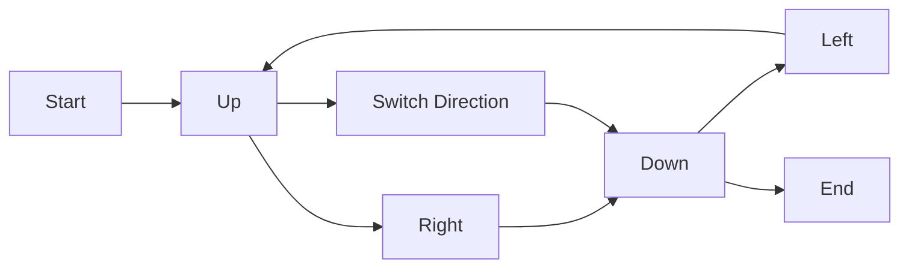

<h2><a href="https://leetcode.com/problems/diagonal-traverse">498. Diagonal Traverse</a></h2>

<p>Given an <code>m x n</code> matrix <code>mat</code>, return <em>an array of all the elements of the array in a diagonal order</em>.</p>

<p>&nbsp;</p>
<p><strong class="example">Example 1:</strong></p>

<pre><strong>Input:</strong> mat = [[1,2,3],[4,5,6],[7,8,9]]
<strong>Output:</strong> [1,2,4,7,5,3,6,8,9]
</pre>

<p><strong class="example">Example 2:</strong></p>

<pre><strong>Input:</strong> mat = [[1,2],[3,4]]
<strong>Output:</strong> [1,2,3,4]
</pre>

<p>&nbsp;</p>
<p><strong>Constraints:</strong></p>

<ul>
	<li><code>m == mat.length</code></li>
	<li><code>n == mat[i].length</code></li>
	<li><code>1 &lt;= m, n &lt;= 10<sup>4</sup></code></li>
	<li><code>1 &lt;= m * n &lt;= 10<sup>4</sup></code></li>
	<li><code>-10<sup>5</sup> &lt;= mat[i][j] &lt;= 10<sup>5</sup></code></li>
</ul>


---

# 🛍️ Diagonal-Traverse | Explained

## Approach 1: Iterative Diagonal Traversal
### Intuition
The intuition behind this approach is to traverse the matrix diagonally, switching directions when we reach the boundary of the matrix. This is similar to how a ball would bounce off the walls of a billiard table, changing direction when it hits an edge. By doing so, we can traverse all the elements in the matrix in a diagonal order.

### Algorithm Visualized


### Approach
The algorithm starts by initializing variables to keep track of the current row, column, and direction. It then enters a loop that continues until all elements in the matrix have been visited. Inside the loop, it checks the current direction and moves accordingly, either up and right or down and left. When it reaches the boundary of the matrix, it switches direction.

### Detailed Code Analysis
The code starts by initializing variables `m` and `n` to store the number of rows and columns in the matrix, respectively. It also initializes an array `arr` to store the result and variables `i`, `row`, and `col` to keep track of the current position.

The code then enters a while loop that continues until all elements in the matrix have been visited. Inside the loop, it checks the current direction `up`. If `up` is true, it moves up and right in the matrix, storing the elements in the `arr` array. If `up` is false, it moves down and left in the matrix, storing the elements in the `arr` array.

When it reaches the boundary of the matrix, it switches direction by toggling the `up` variable.

### Code
```java
class Solution {
    public int[] findDiagonalOrder(int[][] mat) {
        int m = mat.length;
        int n = mat[0].length;
        int arr[] = new int[m * n];
        int i = 0;
        int row = 0, col = 0;
        boolean up = true;

        while (row < m && col < n) {
            if (up) {
                while (row > 0 && col < n - 1) {
                    arr[i++] = mat[row][col];
                    row--;
                    col++;
                }
                arr[i++] = mat[row][col];
                if (col == n - 1) {
                    row++;
                } else {
                    col++;
                }
            } else {
                while (col > 0 && row < m - 1) {
                    arr[i++] = mat[row][col];
                    row++;
                    col--;
                }
                arr[i++] = mat[row][col];
                if (row == m - 1) {
                    col++;
                } else {
                    row++;
                }
            }
            up = !up;
        }
        return arr;
    }
}
```

### Complexity
- **Time:** The time complexity of this approach is O(m * n), where m is the number of rows and n is the number of columns in the matrix. This is because we visit each element in the matrix exactly once.
- **Space:** The space complexity of this approach is O(m * n), where m is the number of rows and n is the number of columns in the matrix. This is because we store the result in an array of size m * n.

## 🕵️‍♂️ Follow-up Questions (Optional)
- What if the matrix is not a rectangle, but a jagged array where each row has a different number of columns? In this case, we would need to adjust the code to handle the variable-length rows.
- How would you modify the code to traverse the matrix in a reverse diagonal order? To do this, we could simply change the initial direction and the conditions for switching direction.