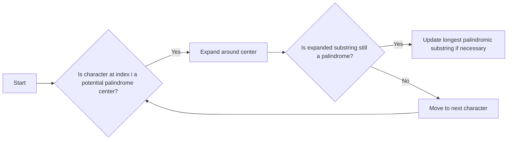

<h2><a href="https://leetcode.com/problems/longest-palindromic-substring">5. Longest Palindromic Substring</a></h2>

<p>Given a string <code>s</code>, return <em>the longest</em> <span data-keyword="palindromic-string" class=" cursor-pointer relative text-dark-blue-s text-sm"><button type="button" aria-haspopup="dialog" aria-expanded="false" aria-controls="radix-_r_t_" data-state="closed" class=""><em>palindromic</em></button></span> <span data-keyword="substring-nonempty" class=" cursor-pointer relative text-dark-blue-s text-sm"><button type="button" aria-haspopup="dialog" aria-expanded="false" aria-controls="radix-_r_u_" data-state="closed" class=""><em>substring</em></button></span> in <code>s</code>.</p>

<p>&nbsp;</p>
<p><strong class="example">Example 1:</strong></p>

<pre><strong>Input:</strong> s = "babad"
<strong>Output:</strong> "bab"
<strong>Explanation:</strong> "aba" is also a valid answer.
</pre>

<p><strong class="example">Example 2:</strong></p>

<pre><strong>Input:</strong> s = "cbbd"
<strong>Output:</strong> "bb"
</pre>

<p>&nbsp;</p>
<p><strong>Constraints:</strong></p>

<ul>
	<li><code>1 &lt;= s.length &lt;= 1000</code></li>
	<li><code>s</code> consist of only digits and English letters.</li>
</ul>


---

# 🛍️ Longest-Palindromic-Substring | Explained

## Approach 1: Expand Around Center
### Intuition
The intuition behind this approach is to treat each character in the string as the center of a potential palindrome. By expanding around this center, we can determine the longest palindromic substring. This approach works because it systematically checks all possible substrings that could be palindromes, ensuring that the longest one is found.

### Algorithm Visualized


### Approach
The algorithm iterates over each character in the input string, treating it as the center of a potential palindrome. For each character, it checks for two types of palindromes: odd-length palindromes (where the character is the center) and even-length palindromes (where the character and the next one are the centers). The `expand` function is used to expand around the center and find the longest palindromic substring.

### Detailed Code Analysis
The code starts by initializing an empty string `ans` to store the longest palindromic substring found so far. The outer loop iterates over each character in the input string `s`. For each character at index `i`, it calls the `expand` function twice: once with `i` and `i` as the center (for odd-length palindromes) and once with `i` and `i+1` as the center (for even-length palindromes). The `expand` function takes a string `str`, a left index `left`, and a right index `right` as parameters. It then enters a while loop that continues as long as `left` is greater than or equal to 0, `right` is less than the length of the string, and the characters at indices `left` and `right` are equal. Inside the loop, it decrements `left` and increments `right`, effectively expanding around the center. Once the loop exits, it returns the substring from `left+1` to `right`, which is the longest palindromic substring centered at `left` and `right`. The code then updates `ans` if the length of the returned substring is greater than the length of the current `ans`.

### Code
```java
class Solution {
    public String longestPalindrome(String s) {
        String ans = "";
        for(int i=0;i<s.length();i++){
            String p1 = expand(s, i, i);
            String p2 = expand(s, i, i+1);

            if(p1.length() > ans.length()){
                ans = p1;
            }
            if(p2.length() > ans.length()){
                ans = p2;
            }
        }
        return ans;
    }

    String expand(String str, int left, int right){
        while( left >= 0 && right < str.length() && str.charAt(left) == str.charAt(right)){
            left--;
            right++;
        }
        return str.substring(left+1, right);
    }
}
```

### Complexity
- **Time:** O(n^2), where n is the length of the input string. The outer loop iterates over each character, and the `expand` function has a while loop that potentially expands around each character.
- **Space:** O(1), excluding the space required for the input and output strings. The space used by the algorithm does not grow with the size of the input, making it constant.