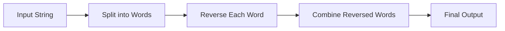

<h2><a href="https://leetcode.com/problems/reverse-words-in-a-string-iii">557. Reverse Words in a String III</a></h2>

<p>Given a string <code>s</code>, reverse the order of characters in each word within a sentence while still preserving whitespace and initial word order.</p>

<p>&nbsp;</p>
<p><strong class="example">Example 1:</strong></p>

<pre><strong>Input:</strong> s = "Let's take LeetCode contest"
<strong>Output:</strong> "s'teL ekat edoCteeL tsetnoc"
</pre>

<p><strong class="example">Example 2:</strong></p>

<pre><strong>Input:</strong> s = "Mr Ding"
<strong>Output:</strong> "rM gniD"
</pre>

<p>&nbsp;</p>
<p><strong>Constraints:</strong></p>

<ul>
	<li><code>1 &lt;= s.length &lt;= 5 * 10<sup>4</sup></code></li>
	<li><code>s</code> contains printable <strong>ASCII</strong> characters.</li>
	<li><code>s</code> does not contain any leading or trailing spaces.</li>
	<li>There is <strong>at least one</strong> word in <code>s</code>.</li>
	<li>All the words in <code>s</code> are separated by a single space.</li>
</ul>


---

# 🛍️ Reverse-Words-in-a-String-III | Explained

## Approach 1: Split and Reverse
### Intuition
The core idea behind this approach is to treat the input string as a collection of words separated by spaces. By splitting the string into individual words, we can then reverse each word separately and combine them back into a single string. This approach works because it takes advantage of the fact that the input string is composed of distinct words, allowing us to process each word independently.

### Algorithm Visualized


### Approach
The high-level logic of this approach involves the following steps:

1. Split the input string into individual words.
2. Reverse each word separately.
3. Combine the reversed words back into a single string.

### Detailed Code Analysis
Let's dive into the code block:
```java
String[] words = s.split(" ");
```
This line splits the input string `s` into an array of words using the space character as a delimiter. The resulting array `words` contains each word from the input string as a separate element.

```java
StringBuilder result = new StringBuilder();
```
Here, we create a `StringBuilder` object called `result` to store the final output string. We use a `StringBuilder` instead of a regular string because it is more efficient for concatenating strings.

```java
for (String word : words) {
    StringBuilder reversedWord = new StringBuilder(word).reverse();
    result.append(reversedWord).append(" ");
}
```
This loop iterates over each word in the `words` array. For each word, we create a new `StringBuilder` object called `reversedWord` by constructing a `StringBuilder` from the word and then reversing it using the `reverse()` method. We then append the reversed word to the `result` StringBuilder, followed by a space character.

```java
result.deleteCharAt(result.length() - 1);
```
After the loop completes, we remove the extra space character at the end of the `result` string by deleting the last character.

```java
return result.toString();
```
Finally, we convert the `result` StringBuilder to a regular string using the `toString()` method and return it as the final output.

### Code
```java
class Solution {
    public String reverseWords(String s) {
        String[] words = s.split(" ");
        StringBuilder result = new StringBuilder();
        for (String word : words) {
            StringBuilder reversedWord = new StringBuilder(word).reverse();
            result.append(reversedWord).append(" ");
        }
        result.deleteCharAt(result.length() - 1);  
        return result.toString();        
    }
}
```

### Complexity
- **Time:** O(n \* m), where n is the number of words in the input string and m is the maximum length of a word. This is because we are iterating over each character in each word to reverse it.
- **Space:** O(n \* m), where n is the number of words in the input string and m is the maximum length of a word. This is because we are storing each word and the reversed words in separate StringBuilder objects.

## 🕵️‍♂️ Follow-up Questions (Optional)
Some common follow-up questions for this pattern include:

* How would you optimize this solution for very large input strings?
* Can you solve this problem without using the `split()` method?
* How would you handle cases where the input string contains leading or trailing spaces?