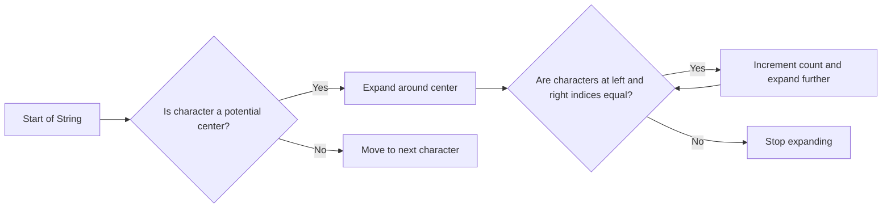

<h2><a href="https://leetcode.com/problems/palindromic-substrings">647. Palindromic Substrings</a></h2>

<p>Given a string <code>s</code>, return <em>the number of <strong>palindromic substrings</strong> in it</em>.</p>

<p>A string is a <strong>palindrome</strong> when it reads the same backward as forward.</p>

<p>A <strong>substring</strong> is a contiguous sequence of characters within the string.</p>

<p>&nbsp;</p>
<p><strong class="example">Example 1:</strong></p>

<pre><strong>Input:</strong> s = "abc"
<strong>Output:</strong> 3
<strong>Explanation:</strong> Three palindromic strings: "a", "b", "c".
</pre>

<p><strong class="example">Example 2:</strong></p>

<pre><strong>Input:</strong> s = "aaa"
<strong>Output:</strong> 6
<strong>Explanation:</strong> Six palindromic strings: "a", "a", "a", "aa", "aa", "aaa".
</pre>

<p>&nbsp;</p>
<p><strong>Constraints:</strong></p>

<ul>
	<li><code>1 &lt;= s.length &lt;= 1000</code></li>
	<li><code>s</code> consists of lowercase English letters.</li>
</ul>


---

# 🛍️ Palindromic-Substrings | Explained

## Approach 1: Expand Around Center
### Intuition
The intuition behind this approach is to treat each character in the string as the center of a potential palindrome. By expanding outwards from the center, we can count the number of palindromic substrings. This approach works because a palindrome is symmetric around its center, so by checking all possible centers and expanding outwards, we can find all palindromic substrings.

### Algorithm Visualized


### Approach
The approach involves iterating over each character in the string and treating it as a potential center of a palindrome. For each center, we expand outwards by checking the characters on either side. If the characters are equal, we increment the count of palindromic substrings and continue expanding. If the characters are not equal, we stop expanding and move on to the next character.

### Detailed Code Analysis
Let's break down the code line by line:
- Line 1-2: The class `Solution` is defined with a method `countSubstrings` that takes a string `s` as input.
- Line 3: An integer `count` is initialized to store the count of palindromic substrings.
- Line 4: A loop is started to iterate over each character in the string.
- Line 5-6: For each character, the `expand` method is called twice: once with the character as the center of a single-character palindrome, and once with the character as the center of a two-character palindrome.
- Line 11-21: The `expand` method takes a string `str`, a left index `left`, and a right index `right` as input. It initializes a count to 0 and then enters a loop where it checks if the characters at the left and right indices are equal.
- Line 14-19: If the characters are equal, the count is incremented, and the left index is decremented while the right index is incremented. This effectively expands the palindrome outwards.
- Line 20: The count of palindromic substrings is returned.

### Code
```java
class Solution {
    public int countSubstrings(String s) {
        int count = 0;
        for (int i = 0; i < s.length(); i++) {
            count += expand(s, i, i);
            count += expand(s, i, i + 1);
        }
        return count;
    }

    int expand(String str, int left, int right) {
        int count = 0;
        while (left >= 0 && right < str.length() && str.charAt(left) == str.charAt(right)) {
            count++;
            left--;
            right++;
        }
        return count;
    }
}
```

### Complexity
- **Time:** The time complexity is O(n^2), where n is the length of the string. This is because in the worst case, we are expanding around each character, which takes O(n) time. Since we do this for each character, the overall time complexity is O(n^2).
- **Space:** The space complexity is O(1), which means the space required does not grow with the size of the input string. This is because we are only using a constant amount of space to store the count and indices.