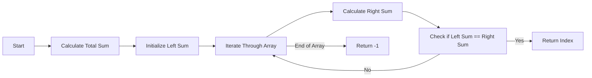

<h2><a href="https://leetcode.com/problems/find-pivot-index">724. Find Pivot Index</a></h2>

<p>Given an array of integers <code>nums</code>, calculate the <strong>pivot index</strong> of this array.</p>

<p>The <strong>pivot index</strong> is the index where the sum of all the numbers <strong>strictly</strong> to the left of the index is equal to the sum of all the numbers <strong>strictly</strong> to the index's right.</p>

<p>If the index is on the left edge of the array, then the left sum is <code>0</code> because there are no elements to the left. This also applies to the right edge of the array.</p>

<p>Return <em>the <strong>leftmost pivot index</strong></em>. If no such index exists, return <code>-1</code>.</p>

<p>&nbsp;</p>
<p><strong class="example">Example 1:</strong></p>

<pre><strong>Input:</strong> nums = [1,7,3,6,5,6]
<strong>Output:</strong> 3
<strong>Explanation:</strong>
The pivot index is 3.
Left sum = nums[0] + nums[1] + nums[2] = 1 + 7 + 3 = 11
Right sum = nums[4] + nums[5] = 5 + 6 = 11
</pre>

<p><strong class="example">Example 2:</strong></p>

<pre><strong>Input:</strong> nums = [1,2,3]
<strong>Output:</strong> -1
<strong>Explanation:</strong>
There is no index that satisfies the conditions in the problem statement.</pre>

<p><strong class="example">Example 3:</strong></p>

<pre><strong>Input:</strong> nums = [2,1,-1]
<strong>Output:</strong> 0
<strong>Explanation:</strong>
The pivot index is 0.
Left sum = 0 (no elements to the left of index 0)
Right sum = nums[1] + nums[2] = 1 + -1 = 0
</pre>

<p>&nbsp;</p>
<p><strong>Constraints:</strong></p>

<ul>
	<li><code>1 &lt;= nums.length &lt;= 10<sup>4</sup></code></li>
	<li><code>-1000 &lt;= nums[i] &lt;= 1000</code></li>
</ul>

<p>&nbsp;</p>
<p><strong>Note:</strong> This question is the same as&nbsp;1991:&nbsp;<a href="https://leetcode.com/problems/find-the-middle-index-in-array/" target="_blank">https://leetcode.com/problems/find-the-middle-index-in-array/</a></p>


---

# 🛍️ Find-Pivot-Index | Explained

## Approach 1: Two-Pass Solution with Prefix Sum Concept
### Intuition
The core idea behind this approach is to find the total sum of the array and then for each element, calculate the sum of elements to its left and right. If the left sum equals the right sum, that index is the pivot index. This approach works by essentially treating each element as a potential pivot and checking if the sums on either side are balanced.

### Algorithm Visualized


### Approach
The algorithm starts by calculating the total sum of the input array. Then, it iterates through the array, maintaining a running sum of elements to the left of the current index. For each index, it calculates the sum of elements to the right by subtracting the left sum and the current element from the total sum. If the left sum equals the right sum, it returns the current index as the pivot index. If no such index is found after iterating through the entire array, it returns -1 to indicate that no pivot index exists.

### Detailed Code Analysis
The code begins by initializing a variable `total` to 0, which will store the total sum of the array. It then iterates through the array to calculate this sum, adding each element to `total`.
```java
int total = 0;
for (int i = 0; i < nums.length; i++) {
    total = total + nums[i];
}
```
Next, it initializes `leftSum` to 0, representing the sum of elements to the left of the current index. It then iterates through the array again, calculating `rightSum` for each index `i` by subtracting `leftSum` and `nums[i]` from `total`. If `leftSum` equals `rightSum`, it returns `i` as the pivot index.
```java
int leftSum = 0;
for (int i = 0; i < nums.length; i++) {
    int rightSum = total - leftSum - nums[i];
    if (leftSum == rightSum) {
        return i;
    }
    leftSum = leftSum + nums[i];
}
```
If the loop completes without finding a pivot index, it returns -1.

### Code
```java
public int pivotIndex(int[] nums) {
    int total = 0;
    for (int i = 0; i < nums.length; i++) {
        total = total + nums[i];
    }
    int leftSum = 0;
    for (int i = 0; i < nums.length; i++) {
        int rightSum = total - leftSum - nums[i];
        if (leftSum == rightSum) {
            return i;
        }
        leftSum = leftSum + nums[i];
    }
    return -1;
}
```

### Complexity
- **Time:** O(n), where n is the number of elements in the input array. This is because the algorithm makes two passes through the array: one to calculate the total sum and another to find the pivot index.
- **Space:** O(1), excluding the space needed for the input and output, as the algorithm uses a constant amount of space to store the total sum and the left sum.

## 🕵️‍♂️ Follow-up Questions
1. **What if the input array is empty or contains a single element?** The algorithm will return -1 for an empty array or 0 for an array with a single element, as there is no pivot index in these cases.
2. **Can there be multiple pivot indices in an array?** No, according to the problem definition, there can be at most one pivot index. If there are multiple such indices, the algorithm will return the first one it encounters.