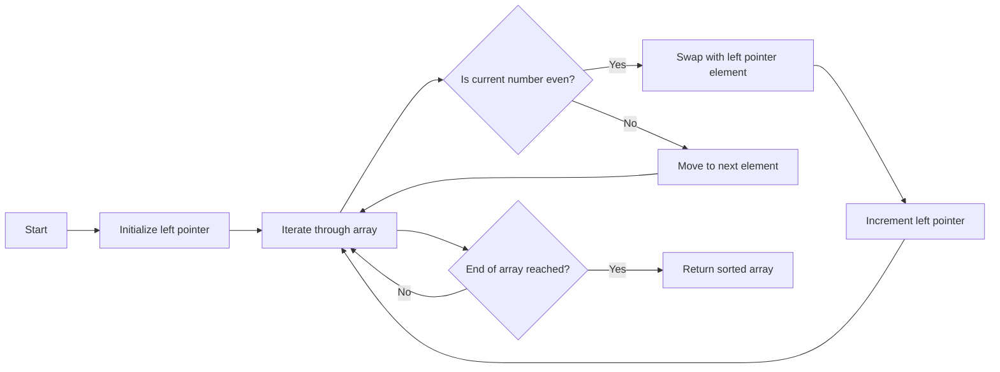

<h2><a href="https://leetcode.com/problems/sort-array-by-parity">905. Sort Array By Parity</a></h2>

<p>Given an integer array <code>nums</code>, move all the even integers at the beginning of the array followed by all the odd integers.</p>

<p>Return <em><strong>any array</strong> that satisfies this condition</em>.</p>

<p>&nbsp;</p>
<p><strong class="example">Example 1:</strong></p>

<pre><strong>Input:</strong> nums = [3,1,2,4]
<strong>Output:</strong> [2,4,3,1]
<strong>Explanation:</strong> The outputs [4,2,3,1], [2,4,1,3], and [4,2,1,3] would also be accepted.
</pre>

<p><strong class="example">Example 2:</strong></p>

<pre><strong>Input:</strong> nums = [0]
<strong>Output:</strong> [0]
</pre>

<p>&nbsp;</p>
<p><strong>Constraints:</strong></p>

<ul>
	<li><code>1 &lt;= nums.length &lt;= 5000</code></li>
	<li><code>0 &lt;= nums[i] &lt;= 5000</code></li>
</ul>


---

# 🛍️ Sort-Array-By-Parity | Explained

## Approach 1: Two-Pointer Technique
### Intuition
This approach works by utilizing two pointers, one at the beginning of the array and one that iterates through the array. The core idea behind this approach is to swap even numbers to the front of the array as we encounter them, effectively creating a partition between even and odd numbers. This is similar to a real-world scenario where we are separating objects of different types into distinct groups.

### Algorithm Visualized

### Approach
The algorithm starts by initializing the `left` pointer to the beginning of the array. It then iterates through the array using the `i` pointer. If the current number is even, it swaps the current number with the number at the `left` pointer and increments the `left` pointer. If the current number is odd, it simply moves on to the next number. This process continues until the end of the array is reached, resulting in all even numbers being partitioned to the front of the array.

### Detailed Code Analysis
Let's break down the code step by step:
- `int left = 0;` initializes the `left` pointer to the beginning of the array.
- The `for` loop iterates through the array using the `i` pointer.
- `if (nums[i] % 2 == 0)` checks if the current number is even.
- If the number is even, the following lines swap the current number with the number at the `left` pointer:
  - `int temp = nums[left];` stores the value at the `left` pointer in a temporary variable.
  - `nums[left] = nums[i];` assigns the value of the current number to the `left` pointer.
  - `nums[i] = temp;` assigns the value stored in the temporary variable back to the current number.
- `left++;` increments the `left` pointer after swapping.
- The loop continues until the end of the array is reached.
- Finally, the sorted array is returned.

### Code
```java
class Solution {
    public int[] sortArrayByParity(int[] nums) {
        int left = 0;

        for (int i = 0; i < nums.length; i++) {
            if (nums[i] % 2 == 0) {
                int temp = nums[left];
                nums[left] = nums[i];
                nums[i] = temp;
                left++;
            }
        }

        return nums;        
    }
}
```
### Complexity
- **Time:** The time complexity of this approach is O(n), where n is the number of elements in the array. This is because we are iterating through the array once.
- **Space:** The space complexity is O(1), as we are only using a constant amount of space to store the `left` pointer and the temporary swap variable, regardless of the size of the input array.

## 🕵️‍♂️ Follow-up Questions (Optional)
1. How would you modify the algorithm to sort the array in-place by parity in descending order (i.e., all odd numbers first, then all even numbers)?
   - To achieve this, you would need to adjust the condition in the `if` statement to `if (nums[i] % 2 != 0)` and modify the swapping logic accordingly.
2. Can you optimize the algorithm for scenarios where the input array is very large and memory is a concern?
   - The algorithm already has a space complexity of O(1), making it memory-efficient for large input arrays. However, in terms of time complexity, the current approach is already optimal at O(n), as you must at least look at each element once to determine its parity and sort it accordingly.